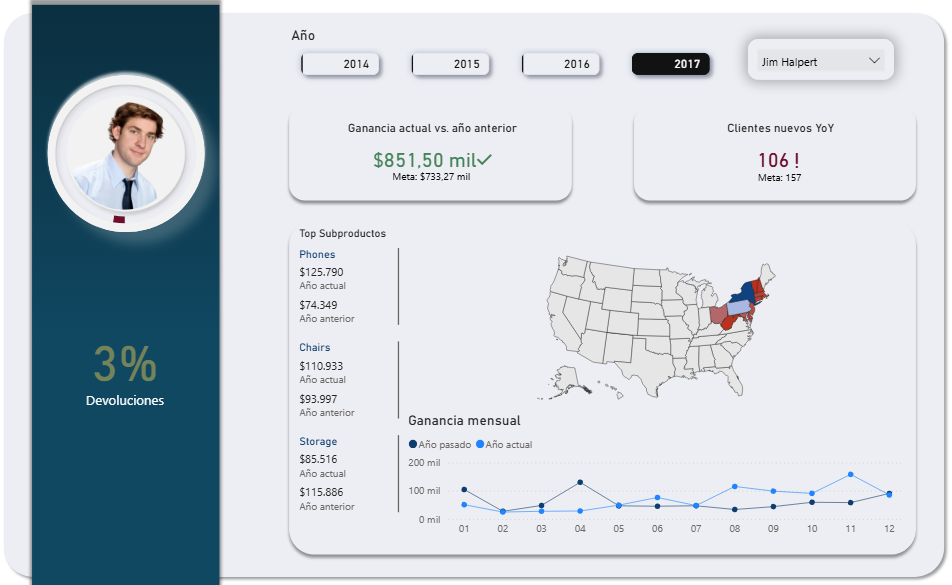

# Sales Analysis and Modeling Project: *North America Retail Supply Chain Sales*

## Overview

This project aims to build a **data model** based on a North American retail sales database, integrating tools such as **Python**, **PostgreSQL**, and **Power BI**.

The work combines **data modeling, customer behavior analysis, and predictive modeling**, all focused on supporting **data-driven decision-making**.

## Data Source

**Database:** `north-america-retail-supply-chain-sales`
The dataset contains transactional sales information, including details on customers, products, regions, and sellers.

Based on this raw data, an analytical model was developed in **Python** within the notebook:
`Modelo_datos_python.ipynb`

## Data Modeling

Starting from the general sales table, a **Star Schema** relational model was designed, composed of:

### Dimension Tables

* **Calendar** – Temporal structure for date management.
* **DimCustomers** – Customer information.
* **DimProducts** – Product catalog.
* **DimRegion** – Geographical sales regions.
* **DimSegment** – Business segments.
* **DimSellers** – Sales representatives.
* **DimShip** – Shipping methods and types.

### Fact Tables

* **FactSales** – Quantitative sales transactions.
* **FactTransaction** – Detailed record of individual operations.

All generated tables were stored in the following directory:
📁 `Bases_Datos/`

## Power BI Dashboard

The modeled data was imported into **Power BI** to create an **interactive sales dashboard**.

The dashboard is designed to analyze:

* Annual sales by employees.
* Customer behavior over time.
* Retention and churn metrics.
* Sales forecasting using ARIMA models.

View Dashboard: [Click here](https://mavenshowcase.com/project/52157)

## Customer Behavior Metrics

Some of the key performance metrics being developed include:

* **Recurring Customers:**
  These are identified as customers who make purchases consistently within a defined time period.
  The procedure used to determine this interval is documented in [`SQL/AnalisisComportamientoClientes.sql`](SQL/AnalisisComportamientoClientes.sql).
  Based on the **quartile analysis**, it was determined that customers who **make at least three purchases within a six-month period** can be classified as **recurring customers**.

* **Lost Customers:**
  Customers who have stopped purchasing after a period of inactivity.

* **Churn Rate:**
  Percentage of customers lost compared to the total number of customers during a given period.

These analyses are implemented in **PostgreSQL**, in the following files:
`AnalisisComportamientoClientes.sql` — Customer behavior analysis
`Tables.sql` — Database schema design

Location:
📁 `SQL/`

## Sales Forecasting (ARIMA)

In parallel, **monthly sales data** is being analyzed to build an **ARIMA model** for forecasting future sales trends.

The datasets used for this process are stored in:
📁 `Ventas_por_mes/`

## Technologies Used

* **Language:** Python 3.11
* **Database:** PostgreSQL
* **Visualization:** Power BI
* **Python Libraries:**

  * `pandas`, `numpy` → Data manipulation and cleaning.
  * `pmdarima` → ARIMA forecasting models.

## Next Steps

1. Train and evaluate the **ARIMA** sales forecasting model.

## Author

**Ernesto F.**

> **Project in Development – 2025**
> *Junior Data Analyst | Data Science Trainee | Focused on data analysis, modeling, and visualization for decision-making, applying techniques in Data Analytics, Machine Learning, and Predictive Modeling.*

