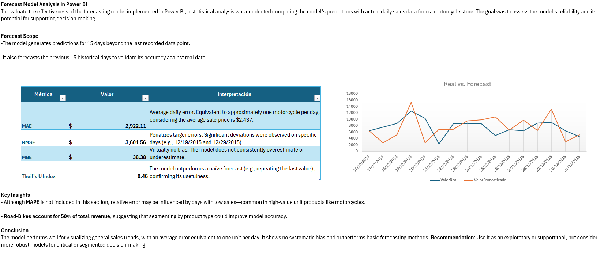

# Sales Analysis Project: *VentaBicisPeru*

## Overview

This project aims to analyze the **sales performance** of a company dedicated to **bicycle sales in Peru**, through **data modeling and interactive visualization in Power BI**.

The work began with a **general sales table**, which was modeled in **Power BI** using **Power Query**, in order to structure an efficient and analytical data model.

## Data Modeling

Based on the original dataset, a model was designed with the following tables:

### Dimension Tables

* **Customers** – Buyer information.
* **Products** – Catalog of bicycles and accessories.
* **Store** – Data of branches and points of sale.

### Fact Table

* **Sales** – Record of all completed transactions.

All tables are stored in the following folder:
📁 `BaseDatos/`

## Power BI Dashboard

An **interactive Power BI dashboard** was developed, allowing exploration of key sales metrics, store performance, and customer behavior.

**📊 Interactive Dashboard**
[Access the dashboard](https://ejemplo.com/tu-dashboard)

During development, two main analytical questions emerged:

### 1. What motivated customers to make more than one purchase?

Out of all recorded transactions, **only 4 customers made more than one purchase**.

**Analysis:**
The available data does not provide a definitive cause. However, **three of the four customers made their purchases at the AW Breña store**, suggesting there might have been **specific incentives or promotions** that encouraged repeat purchases.

This type of insight is crucial for designing **customer retention** and **behavior-based marketing** strategies.

The full analysis can be found here:
[`AnalisisParticular/Analisis.ipynb`](AnalisisParticular/Analisis.ipynb)

📁 The SQL query used to extract the data for this analysis is located in:
`SQL/`

### 2. Is the Power BI forecast model reliable?

Power BI’s native **forecasting tool** was used to estimate future sales trends.

The forecast results were then exported and a **statistical evaluation in Excel** was performed to assess its performance.

The complete procedure is documented in:
`AnalisisModeloForecast.xlsx`

The image below shows the **visual assessment of the model and its statistical metrics**:

---

## Technologies Used

* **Power BI** – Modeling, visualization, and forecasting.
* **Power Query** – Data transformation and modeling.
* **SQL** – Data extraction and filtering.
* **Python (Jupyter Notebook)** – In-depth case analysis.
* **Excel** – Statistical evaluation of the forecast model.

---

## Author

**Ernesto F.**

> **Project in progress – 2025**
> *Junior Data Analyst | Data Science Trainee | Focused on data analysis, modeling, and visualization for decision-making, applying techniques in Data Analytics, Machine Learning, and Predictive Modeling.*

