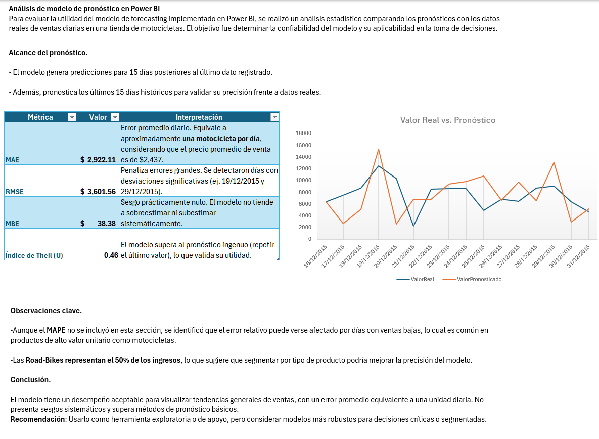

# Proyecto de Análisis de Ventas: *VentaBicisPeru*

## Descripción General

Este proyecto tiene como objetivo analizar el comportamiento de ventas de una empresa dedicada a la **venta de bicicletas en Perú**, mediante la **modelación de datos y visualización interactiva en Power BI**.

Se partió de una **tabla general de ventas**, la cual fue modelada en **Power BI** utilizando **Power Query**, para estructurar un modelo de datos eficiente y analítico.

## Modelado de Datos

A partir del conjunto de datos original, se diseñó un modelo compuesto por las siguientes tablas:

### Tablas de Dimensión

* **Clientes** – Información de los compradores.
* **Productos** – Catálogo de bicicletas y accesorios.
* **Tienda** – Datos de las sucursales y puntos de venta.

### Tabla de Hechos

* **Ventas** – Registro de todas las transacciones realizadas.

Todas las tablas se encuentran almacenadas en la carpeta:
📁 `BaseDatos/`

## Dashboard en Power BI

Se desarrolló un **dashboard interactivo en Power BI**, permitiendo explorar indicadores clave de ventas, desempeño por tienda y comportamiento de clientes.

 **📊 Dashboard Interactivo**
[Acceder al dashboard](https://ejemplo.com/tu-dashboard)

Durante su desarrollo surgieron dos preguntas analíticas principales:

### 1. ¿Qué motivó a los clientes a realizar más de una compra?

De todas las transacciones registradas, **solo 4 clientes realizaron más de una compra**.

**Análisis:**
Los datos disponibles no permiten determinar una causa definitiva. Sin embargo, **tres de los cuatro clientes realizaron sus compras en la tienda AW Breña**, lo que sugiere que **podrían existir incentivos específicos o promociones** que motivaron dichas compras.

Este tipo de hallazgos es fundamental para diseñar estrategias de **fidelización de clientes** y **marketing basado en comportamiento**.

El análisis completo se encuentra en:
[`AnalisisParticular/Analisis.ipynb`](AnalisisParticular/Analisis.ipynb)

📁 La consulta SQL utilizada para obtener los datos del análisis está en:
`SQL`

### 2. ¿El modelo de forecast creado por Power BI es bueno?

Se empleó la herramienta de **pronóstico (forecast)** nativa de Power BI para estimar las ventas futuras.

Posteriormente, se exportaron los resultados y se realizó un **análisis estadístico en Excel** para evaluar su desempeño.

El procedimiento completo está documentado en:
`AnalisisModeloForecast.xlsx`

La imagen adjunta muestra la **evaluación visual del modelo y sus métricas estadísticas**.

---

## Tecnologías Utilizadas

* **Power BI** – Modelado, visualización y pronóstico.
* **Power Query** – Transformación y modelado de datos.
* **SQL** – Extracción y filtrado de información relevante.
* **Python (Jupyter Notebook)** – Análisis detallado de casos específicos.
* **Excel** – Evaluación estadística del modelo de forecast.

---

## Autor

**Ernesto F.**

> **Proyecto en desarrollo – 2025**
> *Analista de Datos Jr. | Trainee en Data Science | Enfocado en el análisis, modelado y visualización de datos para la toma de decisiones, aplicando técnicas de Análisis de Datos, Machine Learning y Modelos Predictivos.*
